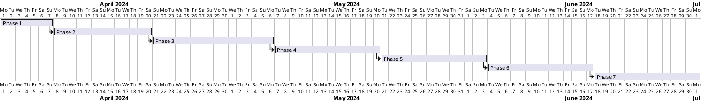

# Persistent Circular Queue Implementation Plan

This plan breaks the project into sequential phases derived from the design document. Each phase lists concrete tasks, estimated effort, and thorough test coverage (unit and integration) to validate every scenario described in the design.

## Phase 1: Foundations & Contracts

- [ ] Define core interfaces (`IQueueManager`, `ICircularBuffer`, `IPersister`, `IDeadLetterQueue`, `IHandlerDispatcher`, `ILeaseMonitor`, `IMessageHandler<T>`, `IQueuePublisher`). _(3d)_
- [ ] Establish shared models (`MessageEnvelope`, `DeadLetterEnvelope`, enums, options records) with serialization attributes. _(2d)_
- [ ] Implement dependency injection registrations and configuration binding skeletons. _(2d)_

### Tests
- **Unit**
  - Contract validations ensuring option defaults align with design (timeouts, retry counts, buffer capacities).
  - Serialization round-trip tests for `MessageEnvelope` and `DeadLetterEnvelope` across polymorphic payloads.
  - DI registration tests confirming service lifetimes and configuration bindings.
- **Integration**
  - Smoke test wiring a minimal host with fake handlers verifying DI resolution and configuration loading.
  - Serialization compatibility test persisting sample envelopes to file and reading back via the shared models.

## Phase 2: Concurrent Circular Buffer & Deduplication

- [ ] Implement lock-free/striped-lock `ConcurrentCircularBuffer` supporting enqueue, checkout, acknowledge, replace-by-key, and slot state transitions. _(6d)_
- [ ] Build deduplication index with optimistic concurrency control and supersede semantics. _(4d)_
- [ ] Create buffer metadata tracking head/tail, version tokens, and lease metadata stubs. _(3d)_

### Tests
- **Unit**
  - CAS advancement logic and slot state machine transitions.
  - Dedup index collision handling, supersede flags, and version comparisons.
  - Lease metadata updates on checkout/ack/requeue operations.
- **Integration**
  - Multi-threaded enqueue/checkout stress harness validating non-blocking behavior and ordering guarantees.
  - Dedup scenario with concurrent producers replacing messages, ensuring consumers see latest ready message.
  - Buffer persistence stub integration confirming metadata remains consistent through replace operations.

## Phase 3: Persistence Layer (Journal + Snapshot)

- [ ] Implement append-only journal writer with CRC validation and WAL semantics. _(5d)_
- [ ] Build snapshot serializer/deserializer for buffer, dedup index, and metadata. _(4d)_
- [ ] Integrate persistence triggers (time/operation thresholds, shutdown hooks) with queue manager. _(3d)_
- [ ] Implement startup recovery sequence (snapshot load, journal replay, DLQ restoration hooks). _(4d)_

### Tests
- **Unit**
  - Journal record encoding/decoding, CRC validation, and truncation safety.
  - Snapshot serialization correctness for circular buffer and dedup index state.
  - Trigger evaluation logic (time-based and threshold-based) under boundary conditions.
- **Integration**
  - Crash-recovery scenario replaying operations and validating restored queue state.
  - Persistence stress test under concurrent producers/consumers verifying durability guarantees.
  - Graceful shutdown test ensuring final snapshot completeness and journal truncation.

## Phase 4: Handler Dispatcher & Worker Infrastructure

- [ ] Implement handler registry using DI metadata (timeouts, parallelism, serialization settings). _(3d)_
- [ ] Build dispatcher worker loops per handler type using channels/auto-reset signaling. _(5d)_
- [ ] Implement lease acquisition/renewal coordination between dispatcher and queue manager. _(3d)_
- [ ] Provide cancellation token orchestration and timeout enforcement per handler invocation. _(3d)_

### Tests
- **Unit**
  - Handler registry lookup and configuration overrides.
  - Channel signaling logic ensuring ready messages awaken appropriate workers.
  - Lease renewal decision logic and timeout cancellation pathways.
- **Integration**
  - Full dispatcher flow with real handlers: enqueue → dispatch → acknowledge path.
  - Parallelism test verifying `MaxParallelism` enforcement and scalability.
  - Timeout scenario causing handler cancellation and message requeue.

## Phase 5: Retry, Lease Monitoring, and Dead-Letter Routing

- [ ] Implement retry counter updates, backoff policies, and max retry enforcement. _(3d)_
- [ ] Build background lease monitor with min-heap scheduling of expiry scans. _(4d)_
- [ ] Integrate DLQ circular buffer, persistence hooks, and management interface stubs. _(4d)_
- [ ] Wire failure handling pipeline (fail → retry → DLQ) within queue manager and dispatcher. _(3d)_

### Tests
- **Unit**
  - Retry counter increments, backoff calculations, and policy boundary conditions.
  - Lease monitor heap operations and expiry detection edge cases.
  - DLQ enqueue/lookup operations and metadata enrichment.
- **Integration**
  - End-to-end failure flow: handler throws, retries until max, message lands in DLQ with metadata.
  - Lease expiry scenario returning message to ready state and incrementing retry count.
  - DLQ persistence cycle verifying entries survive restart and management queries.

## Phase 6: Handler Chaining, Long-Running Support, and Admin APIs

- [ ] Provide `IQueuePublisher` integration enabling handlers to enqueue additional messages. _(3d)_
- [ ] Implement progress heartbeat/lease extension API for long-running handlers. _(3d)_
- [ ] Build admin APIs for scaling handlers, inspecting queue metrics, and triggering manual snapshots/DLQ replays. _(5d)_
- [ ] Integrate monitoring/metrics exporters (queue length, latency, success/failure counts). _(3d)_

### Tests
- **Unit**
  - Queue publisher dedup key propagation and serialization invariants.
  - Lease extension request validation and timeout overrides.
  - Metrics aggregation calculations for queue and handler statistics.
- **Integration**
  - Handler chaining workflow verifying correlation IDs propagate and downstream handlers execute.
  - Long-running handler scenario with heartbeat extending lease and completing successfully.
  - Admin API exercising scale-up/down, manual snapshot, and DLQ replay operations.

## Phase 7: Hardening, Observability & Final QA

- [ ] Conduct full-system soak tests with synthetic workload covering producers/consumers, persistence, retries, DLQ, and admin interactions. _(6d)_
- [ ] Finalize documentation (operational runbooks, configuration guides, API usage). _(3d)_
- [ ] Security and resilience review (file permissions, error handling fallbacks, monitoring alerts). _(3d)_
- [ ] Release readiness checklist (versioning, package publishing scripts). _(2d)_

### Tests
- **Unit**
  - Alerting rule evaluation and fallback behaviors for persistence/dispatcher failure detectors.
  - Configuration validation covering all options with invalid/edge values.
- **Integration**
  - End-to-end regression suite executing all previous scenario flows in combination under load.
  - Chaos testing: simulated persistence outage, handler crash, and DI resolution failure with recovery.
  - Performance benchmarking ensuring throughput/latency targets.

## Timeline

## Scenario Coverage Matrix

| Design Scenario | Phase | Unit Test Coverage | Integration Test Coverage |
| --- | --- | --- | --- |
| Concurrent circular buffer operations | Phase 2 | Slot state machine, CAS head/tail tests | Stress harness, dedup replacement flow |
| Deduplication semantics | Phase 2 | Dedup index collision & supersede | Concurrent producer replacement scenario |
| Persistence strategy (journal + snapshot) | Phase 3 | Journal encoding/trigger logic | Crash recovery, graceful shutdown |
| Startup restoration | Phase 3 | Snapshot/journal decoding | Recovery integration test |
| DI handler dispatching | Phase 4 | Registry lookup | Dispatcher end-to-end flow |
| Lease/timeout handling | Phases 4 & 5 | Lease renewal logic | Timeout requeue, lease expiry recovery |
| Retry & DLQ routing | Phase 5 | Retry counters, DLQ operations | Failure-to-DLQ flow, DLQ persistence |
| Handler scaling & signaling | Phase 4 | Channel signaling | Parallelism enforcement |
| Handler chaining | Phase 6 | Publisher invariants | Correlation workflow |
| Long-running support | Phase 6 | Lease extension validation | Heartbeat lease extension |
| Admin & monitoring | Phase 6 & 7 | Metrics aggregation | Admin API operations |
| Error handling & resilience | Phase 7 | Alerting fallback logic | Chaos testing, soak tests |
| Immediate dispatch w/o polling | Phase 4 | Channel logic | Dispatcher flow |
| Persistence failure resilience | Phase 3 & 7 | Trigger fallbacks | Chaos test with persistence outage |

This implementation plan ensures every scenario from the design document is validated by both unit and integration tests while delivering a structured execution roadmap with estimates and timeline.
